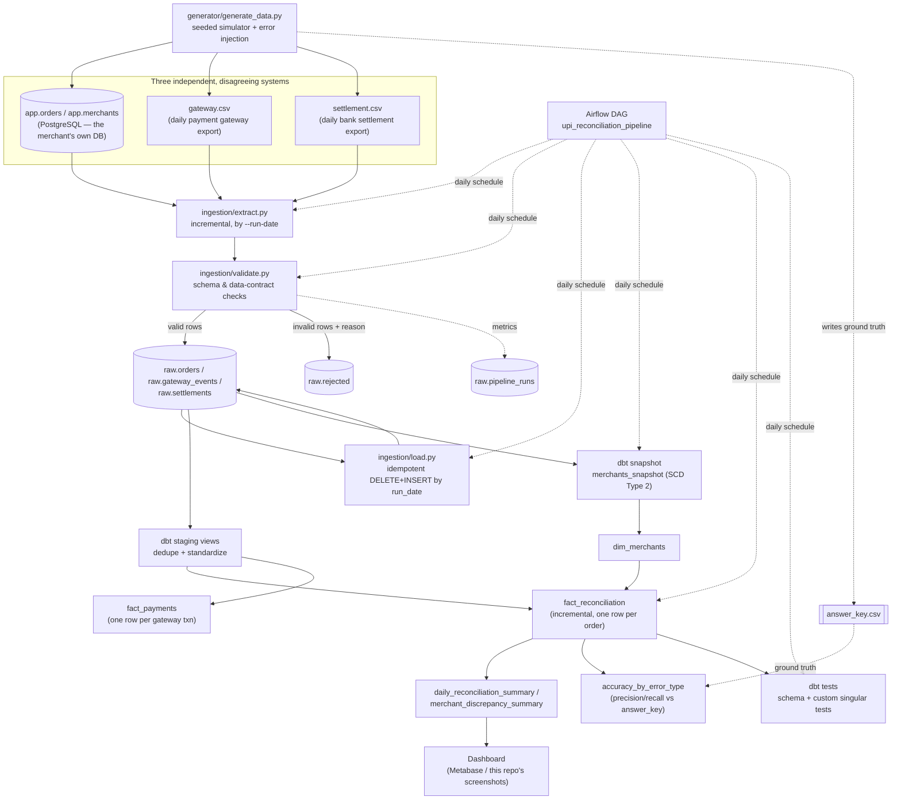
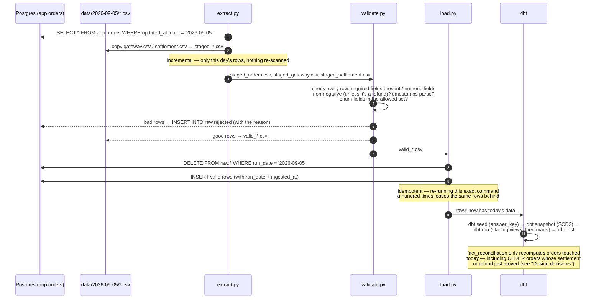
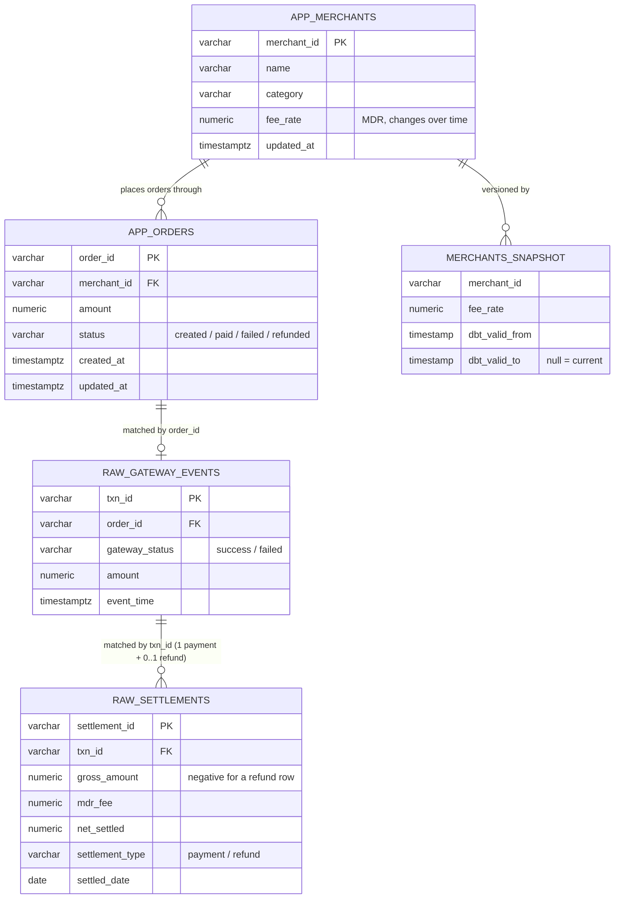

# UPI Payment Reconciliation Pipeline

[](https://github.com/diwakar2905/UPI-Payment-Reconciliation-Pipeline/actions/workflows/ci.yml)
[](requirements.in)
[](dbt_upi/dbt_project.yml)
[](#)

An end-to-end batch data engineering pipeline that reconciles UPI payments across
three systems that never agree with each other out of the box — the merchant
app's own order records, the payment gateway's event log, and the bank's daily
settlement file — and flags every discrepancy with a specific, provable reason.

Everything in this repo is real and runnable: a seeded synthetic-data generator,
Python ingestion with a real data contract, a dbt project with a star schema and
an incremental fact table, an Airflow DAG, a CI pipeline, and a dashboard —
all verified end-to-end against a live Postgres instance, not just written and
hoped to work.

> **New to this repo?** Read this file top to bottom once. By the end you'll
> know exactly what every file does and why it exists, without opening a
> single one of them. Then see **[interview.md](interview.md)** to turn that
> understanding into interview-ready answers.

---

## Table of contents

1. [The problem, in plain terms](#the-problem-in-plain-terms)
2. [What "reconciliation" actually means here](#what-reconciliation-actually-means-here)
3. [Dashboard preview](#dashboard-preview)
4. [Architecture](#architecture)
5. [A day in the life of the pipeline](#a-day-in-the-life-of-the-pipeline)
6. [Tech stack, and why each piece was chosen](#tech-stack-and-why-each-piece-was-chosen)
7. [Repository layout](#repository-layout)
8. [Database schema](#database-schema)
9. [The 8 discrepancy classes](#the-8-discrepancy-classes-the-generator-injects)
10. [Component walkthrough](#component-walkthrough)
    - [1. The synthetic data generator](#1-the-synthetic-data-generator)
    - [2. Ingestion: extract → validate → load](#2-ingestion-extract--validate--load)
    - [3. dbt: staging, snapshots, marts, tests](#3-dbt-staging-snapshots-marts-tests)
    - [4. Orchestration: Airflow](#4-orchestration-airflow)
    - [5. Dashboard](#5-dashboard)
11. [Design decisions (the "why", not just the "what")](#design-decisions-the-why-not-just-the-what)
12. [Run steps](#run-steps)
13. [Measured numbers](#measured-numbers)
14. [Testing & CI](#testing--ci)
15. [Troubleshooting](#troubleshooting)
16. [What's deliberately out of scope](#whats-deliberately-out-of-scope)

---

## The problem, in plain terms

Say a customer pays a merchant ₹500 over UPI. That one payment leaves a trail in
**three different places**, and none of them talk to each other automatically:

1. The merchant's own app records an **order**: "customer X owes/paid ₹500."
2. The **payment gateway** (Razorpay/PhonePe/etc. in real life) independently
   logs "we saw a payment attempt for this order, and it succeeded/failed."
3. A day or two later, the **bank** sends a **settlement file** saying "we
   moved ₹500 minus our fee into the merchant's account."

In a healthy system these three stories agree. In the real world they don't,
constantly:

- The gateway says "success" but the settlement never arrives (**missing
  settlement**).
- The settlement arrives, but a week late (**late settlement**).
- The settlement amount doesn't match the order amount (**amount mismatch**).
- The same order gets charged twice within minutes (**duplicate charge**).
- The gateway has a successful payment for an order that **doesn't exist** in
  the merchant's own database (**orphan payment**).
- The order says "paid" but the gateway says "failed" (or vice versa)
  (**status mismatch**).
- A row in any of the three files is just corrupted — a null key, a negative
  amount, an unparseable date (**invalid row**).
- A customer gets refunded, and that refund has to be tracked as its own
  event, not just erased from the books (**refund**).

Doing this reconciliation by hand — three spreadsheets, a lot of VLOOKUP, a
lot of squinting — is slow, error-prone, and doesn't scale past a few hundred
transactions. This project builds the pipeline that does it automatically, at
any volume, with a paper trail for every discrepancy it finds.

## What "reconciliation" actually means here

Concretely: for every single order, the pipeline answers one question —
**"does the money story agree across all three systems, and if not, exactly
what disagrees?"** — and writes that answer as one row in a table
(`fact_reconciliation`), with a `reconciliation_status` of `matched`,
`discrepancy`, `refunded`, or `pending`, plus one boolean flag per possible
disagreement (`is_missing_settlement`, `is_late_settlement`,
`is_amount_mismatch`, `is_duplicate_charge`, `is_status_mismatch`,
`is_orphan_payment`). Nothing is a vague "looks wrong" — every discrepancy
traces back to one specific, named, testable condition.

## Dashboard preview


This is real output from this pipeline's own marts (`daily_reconciliation_summary`,
`merchant_discrepancy_summary`, `accuracy_by_error_type`), not a mockup. See
[`docs/dashboard.md`](docs/dashboard.md) for the rest of the charts and how to
stand up a live Metabase instance against the same tables.

## Architecture



Four Postgres schemas, each one layer of the pipeline: **`app`** (the source
OLTP tables, standing in for the merchant's own database), **`raw`** (bronze —
exactly what was ingested, unmodified), **`staging`** (deduped, standardized
views — plus the merchant SCD2 snapshot), **`marts`** (the star schema
everything else reads from).

## A day in the life of the pipeline

This is what happens every time you run `make run DATE=2026-09-05` (or every
time the Airflow DAG fires for one day):



## Tech stack, and why each piece was chosen

| Layer | Choice | Why this, specifically |
|---|---|---|
| Language | Python 3.11+ | Generator + ingestion scripts. No framework needed — three small, single-purpose CLI scripts, not a service. |
| Database | PostgreSQL 16 | Free, battle-tested, and `psycopg2`/dbt-postgres support is first-class. Window functions (`distinct on`, `filter (where ...)`) do a lot of the heavy lifting in the marts. |
| Transformation | dbt (dbt-core + dbt-postgres) | SQL-first transformation with built-in testing, snapshots (SCD2 for free), incremental materialization, and lineage — the standard tool for exactly this "raw → staging → marts" shape. |
| Data quality | dbt tests (schema + custom singular SQL tests), pytest | dbt tests live next to the models they test and run as part of the same `dbt test` command; pytest covers the Python layer (generator determinism, validator contracts) that dbt can't reach. |
| Orchestration | Apache Airflow 2.x | Industry-standard scheduler with retries, backfill/`catchup`, and a DAG that mirrors the Makefile's own `run` target almost line for line — so what you test locally is what runs in production. |
| Containerization | Docker Compose | One command (`make docker-up`) for a disposable local Postgres + Metabase, so a fresh clone doesn't need anything installed by hand except Docker. |
| CI/CD | GitHub Actions | Runs the *entire* documented path (generate → ingest → dbt seed/snapshot/run/test → pytest) on every push, against a real ephemeral Postgres service container — not a mocked subset. |
| Dashboard | Metabase (+ this repo's own static screenshots) | Point-and-click BI directly against the marts; the shipped screenshots were generated straight from the same live query results, for environments where standing up Metabase isn't practical. |
| Dependency management | `pip-compile` (pip-tools) | `requirements.in` (loose, human-edited) → `requirements.txt` (fully pinned, machine-generated) — reproducible installs without hand-maintaining 200+ transitive pins. |

## Repository layout

```
├── airflow/
│   └── dags/upi_reconciliation_dag.py   # extract→validate→load→dbt, daily, 3 retries
├── dashboard/
│   └── screenshots/                     # real charts rendered from live marts (see docs/dashboard.md)
├── dbt_upi/
│   ├── models/
│   │   ├── staging/                     # stg_orders, stg_gateway_events, stg_settlements
│   │   └── marts/                       # dim_date, dim_merchants, fact_reconciliation,
│   │                                     # fact_payments, daily/merchant summaries, accuracy model
│   ├── snapshots/merchants_snapshot.sql # SCD Type 2 merchant fee-rate history
│   ├── seeds/answer_key.csv             # ground truth written by the generator
│   ├── tests/                           # custom singular dbt tests
│   └── profiles.yml                     # committed profile (reads Postgres creds from env vars)
├── docs/
│   ├── architecture.md                  # short-form version of this README's architecture section
│   └── dashboard.md                     # dashboard screenshots + Metabase setup
├── generator/
│   ├── config.yaml                      # volumes + injected error rates, all in one place
│   └── generate_data.py                 # the seeded multi-system simulator
├── ingestion/
│   ├── db.py                            # connection/cursor helpers (env-var configured)
│   ├── common.py                        # shared paths + pipeline_runs metrics logging
│   ├── extract.py                       # incremental pull from app.orders + stage CSVs
│   ├── validate.py                      # the data contract; splits valid/invalid
│   └── load.py                          # idempotent delete+insert into raw.*
├── sql/init.sql                         # every schema/table/index, from a blank database
├── tests/                               # pytest: generator determinism, validator contracts
├── docker-compose.yml                   # Postgres + Metabase, for a fresh clone
├── Makefile                             # every command below is `make <target>`
├── requirements.in / requirements.txt   # direct deps / pinned lockfile
└── interview.md                         # this project, turned into interview Q&A
```

## Database schema



| Schema | Purpose | Key tables |
|---|---|---|
| `app` | Source OLTP — the merchant's own database | `merchants`, `orders` |
| `raw` | Bronze — exactly what was ingested for a `run_date`, unmodified | `orders`, `gateway_events`, `settlements`, `rejected` (dead-letter), `pipeline_runs` (audit/metrics) |
| `staging` (dbt schema `staging_staging`) | Deduped, standardized views over `raw.*`, plus the merchant snapshot | `stg_orders`, `stg_gateway_events`, `stg_settlements`, `merchants_snapshot` |
| `marts` (dbt schema `staging_marts`) | The star schema everything downstream reads | `dim_date`, `dim_merchants`, `fact_reconciliation`, `fact_payments`, `daily_reconciliation_summary`, `merchant_discrepancy_summary`, `accuracy_by_error_type` |

> Why `staging_marts` and not just `marts`? dbt's custom-schema convention
> prefixes your `+schema:` config with the profile's target schema
> (`staging`) by default, so `+schema: marts` becomes `staging_marts` in
> Postgres. Cosmetic, but worth knowing before you go looking for a bare
> `marts` schema and don't find one.

## The 8 discrepancy classes the generator injects

Every rate below lives in one place — `generator/config.yaml` — so tuning the
noise level is a one-line change, not a code change.

| Error class | Rate | How it's created | How it's detected |
|---|---|---|---|
| **Missing settlement** | 2.0% | Gateway shows `success`, no settlement row is ever written for that `txn_id` | `is_missing_settlement`: paid/refunded order, gateway success, `settlement_id is null` |
| **Late settlement** | 3.0% | Settlement lands T+3..T+6 instead of the normal T+1 | `is_late_settlement`: `settled_date > gateway_event_time::date + 1` |
| **Amount mismatch** | 1.5% | Settlement's `gross_amount` differs from the order amount by ₹1–500 | `is_amount_mismatch`: `gross_amount != order_amount` |
| **Duplicate charge** | 1.0% | A second gateway event for the same order, 1–5 minutes later, its own `txn_id` | `is_duplicate_charge`: `event_count > 1` per `order_id` |
| **Orphan payment** | 0.5% | A gateway `success` event referencing an `order_id` that was never written to `app.orders` | `is_orphan_payment`: left-joined order is null |
| **Status mismatch** | 1.0% | Order says paid/refunded, gateway independently says failed (or vice versa) | `is_status_mismatch`: expected vs. actual `gateway_status` disagree |
| **Invalid row** | 1.0% (per row, gateway or settlement) | A row gets its key nulled, a numeric field negated, or a date field replaced with garbage, *before* it ever reaches the pipeline | Caught by `ingestion/validate.py`'s data contract → `raw.rejected`, never reaches the marts at all |
| **Refund** | ~5% of orders | A successful payment, settled normally, then reversed 1–3 days later by a second settlement row (`settlement_type='refund'`, negative amounts, no fee reversed) | `is_refunded` + a dedicated `refunded` reconciliation status (not lumped in with `discrepancy` — a refund is an expected business outcome, not an error) |

Two more states exist alongside these: **`pending`** (order still `created`,
not yet resolved — ~2% of orders, resolves 1–2 days later) and **`matched`**
(everything agrees — the majority case, as it should be).

## Component walkthrough

### 1. The synthetic data generator

`generator/generate_data.py` — a `Simulator` class, seeded end-to-end
(`random.Random(seed)`, `Faker.seed(seed)`), so **the exact same command
produces the exact same data every time**. This matters for two reasons:
regenerating data doesn't silently invalidate a debugging session, and the
generator's own `answer_key.csv` output is a trustworthy ground truth to test
the rest of the pipeline against.

What it does, per simulated day (`run_day`):
1. **Resolve pending orders** left over from a previous day (see "pending" above).
2. **Generate new orders** — pick a merchant, an amount, a status (`created`
   / `paid` / `failed` / `refunded`, weighted), write it to `app.orders`.
3. For anything that should have succeeded, **emit a gateway event**, then
   maybe a **settlement** (T+1 by default), then maybe a **refund** row.
4. Inject **orphan payments** — gateway events with no backing order at all.
5. At every step, roll the dice against `config.yaml`'s error rates and,
   if it hits, corrupt that specific record and record *why* in
   `self.answer_key`.

Two implementation details worth knowing (both are things that were *wrong*
at one point and got caught by actually running the pipeline, not by reading
the code — see [interview.md](interview.md) for the full story of each):
- IDs are derived from the seeded `rng.getrandbits(...)`, **not** `uuid.uuid4()`
  — `uuid4` isn't seedable, so using it would have silently broken the
  "same seed → same data" guarantee.
- The "corrupt a date field" path matches on a date-like regex, not a literal
  `"T"` substring — settlement's `settled_date` is a bare date (`2026-09-01`),
  not a full timestamp, so a substring check would have silently no-op'd on
  exactly the field it was supposed to corrupt.

### 2. Ingestion: extract → validate → load

Three small, single-purpose scripts, each taking `--run-date` and each doing
exactly one job:

- **`extract.py`** — pulls `app.orders` rows with `updated_at::date =
  run_date` (this is what makes it *incremental*: it never re-scans the whole
  table), and copies that day's gateway/settlement CSVs into a common
  `staged_*.csv` naming scheme.
- **`validate.py`** — the data contract. For each of the three sources it
  checks: every required field present, numeric fields non-negative (except
  a settlement's `gross_amount`/`net_settled` when `settlement_type='refund'`
  — a refund is *supposed* to be negative), every timestamp parses, every
  enum field (`status`, `gateway_status`, `settlement_type`) is in its
  allowed set. Anything that fails goes to `raw.rejected` as JSON, with a
  human-readable reason. Everything that passes goes to `valid_*.csv`.
- **`load.py`** — idempotent by construction: `DELETE FROM raw.<table> WHERE
  run_date = %s` immediately before the insert, in the same transaction. Run
  it once or a hundred times for the same date, `raw.*` ends up identical.

Every step also logs its row counts and wall-clock duration to
`raw.pipeline_runs` (`ingestion/common.py`'s `log_pipeline_run`) — the
`Ingestion throughput` number in [Measured numbers](#measured-numbers) below
comes straight from that table, not a stopwatch.

### 3. dbt: staging, snapshots, marts, tests

- **Staging** (`dbt_upi/models/staging/`): one view per raw table
  (`stg_orders`, `stg_gateway_events`, `stg_settlements`). Each dedupes on its
  natural key using `row_number() over (partition by <key> order by
  ingested_at desc)` — if the same `order_id`/`txn_id`/`settlement_id` was
  ever loaded twice, only the newest copy survives downstream.
- **Snapshot** (`dbt_upi/snapshots/merchants_snapshot.sql`): SCD Type 2 over
  `app.merchants`, `strategy='timestamp'` on `updated_at`. Every time a
  merchant's fee rate changes, the old row is closed (`dbt_valid_to` set) and
  a new one opens (`dbt_valid_from` = now) — full fee-rate history, for free.
- **Marts** (`dbt_upi/models/marts/`):
  - `dim_date`, `dim_merchants` (built on top of the snapshot, exposing
    `is_current`).
  - **`fact_reconciliation`** — the centerpiece. One row per order (plus
    orphan gateway payments, which have no order to attach to). Joins the
    order to its primary gateway event and settlement, computes five boolean
    discrepancy flags, and rolls them into one `reconciliation_status`. It's
    **incremental** — see [Design decisions](#design-decisions-the-why-not-just-the-what)
    for exactly why that's non-trivial here.
  - **`fact_payments`** — the other half of the star schema: one row per
    *gateway transaction* (including duplicates), for when you need
    transaction-grain detail rather than order-grain.
  - `daily_reconciliation_summary`, `merchant_discrepancy_summary` — reporting
    marts, the direct source for the dashboard.
  - **`accuracy_by_error_type`** — precision/recall of each discrepancy flag
    against the generator's own `answer_key` seed, per error type. This is
    what turns "the pipeline flags some discrepancies" into "the pipeline
    catches 100% of missing settlements and 95% of late settlements, measured,
    not asserted."
- **Tests**: standard schema tests (`unique`, `not_null`, `accepted_values`,
  `relationships`) on every model, plus custom singular tests in
  `dbt_upi/tests/`:
  - `assert_reconciliation_matches_answer_key` — every *matured* order's
    computed status must equal the generator's ground truth.
  - `assert_no_negative_payment_amounts` — no order or gateway amount is ever
    negative (settlements are exempt for refunds, checked above instead).
  - `assert_no_daily_row_count_anomaly` — day-over-day order volume shouldn't
    swing more than 50% (`severity: warn` — a heuristic, not a hard failure).
  - `assert_no_orphan_settlements` — `severity: warn`; a non-zero count here
    is *expected noise* from `invalid_row` corruption and late settlements
    landing outside the ingested window, not a bug (see the file's own
    comment for the full reasoning).

### 4. Orchestration: Airflow

`airflow/dags/upi_reconciliation_dag.py` — six `BashOperator` tasks in a
straight line: `extract >> validate >> load >> dbt_snapshot >> dbt_run >>
dbt_test`. `schedule="@daily"`, `catchup=True` (a backfill reprocesses one day
per DAG run, exactly matching `make run DATE=...`), `retries=3`. Because a
failing task raises and Airflow's default dependency behavior blocks
downstream tasks, a red `dbt_test` (or any earlier step) stops the run —
nothing downstream silently reports success on top of bad data.

### 5. Dashboard

Two ways to see it:
- **The real thing**: `make docker-up` brings up a `metabase` service
  alongside Postgres; point it at the same database and build the questions
  listed in [`docs/dashboard.md`](docs/dashboard.md).
- **Already built**: `dashboard/screenshots/` has real PNGs rendered directly
  from this pipeline's own live query results (not Metabase itself — see that
  doc for exactly why, and how they were generated).

## Design decisions (the "why", not just the "what")

**Why a dbt snapshot for merchants, not a plain SCD2 table?** Merchant fee
rates change over time (renegotiated MDR), and `fact_reconciliation`'s MDR fee
calculation has to use the rate that was in effect *when the order was
placed*, not today's rate. A dbt snapshot (`merchants_snapshot`, timestamp
strategy on `updated_at`) gives us that history for free —
`dbt_valid_from`/`dbt_valid_to` per row — instead of a hand-rolled trigger or
application-level versioning table.

**How idempotency works.** Every ingestion step is keyed by `--run-date`.
`load.py` does `DELETE FROM raw.<table> WHERE run_date = %s` immediately
before its insert, in the same transaction, so re-running `make run
DATE=2026-09-01` a hundred times in a row leaves exactly the same rows in
`raw.*` as running it once. `fact_reconciliation` uses the same idea one layer
up: it's an incremental model keyed on `order_id`, so reprocessing a date
doesn't create duplicate reconciliation rows either.

**Why `fact_reconciliation` is incremental, and how "late data" is handled.**
A naive incremental model that only looks at "orders created on today's
run_date" would miss the entire point of T+1 settlement and refunds: an order
created on day 3 can have its settlement arrive on day 4 and its refund
arrive on day 6-7. So the incremental filter isn't "new orders" — it's "any
order whose `app.orders`, gateway, *or settlement* row was loaded with
`run_date` = today", computed by unioning the order IDs touched across all
three raw tables for that run_date. Everything else in the table is left
untouched (`delete+insert` on `order_id`). This is also why
`assert_reconciliation_matches_answer_key` and `accuracy_by_error_type` only
score orders old enough to have had time to fully settle (a 5-day maturity
buffer, measured from the newest run_date actually loaded, not wall-clock
time) — the newest few days in any given run are *supposed* to look
unsettled, that's not a bug.

**T+1 settlement and refunds as first-class, not edge cases.** Real UPI
settlement lags the payment by one business day; this is the default in the
generator (`settled_date = run_date + 1`), not something bolted on via the
`late_settlement` error — `late_settlement` pushes it to T+3..T+6
specifically so it's distinguishable from normal settlement lag.
`fact_reconciliation`'s `is_late_settlement` flag is measured against
`gateway_event_time + 1 day`, so T+1 itself is never flagged. Refunds are
modeled as a second settlement row (`settlement_type = 'refund'`) against the
same `txn_id`, with a negative `gross_amount`/`net_settled` and no fee
reversal (real MDR/GST typically isn't refunded) — not a mutation of the
original payment settlement, so both the original charge and its reversal
stay auditable.

**Why measure accuracy against a seeded answer key instead of just trusting
the SQL?** Because "the query runs without an error" and "the query is
*correct*" are different claims. `accuracy_by_error_type` exists precisely
because a bug was found this way during development: `fact_reconciliation`'s
final `CASE` statement computed five discrepancy flags but never actually
referenced most of them in the status logic, so orders with real, detected
discrepancies were still coming out `matched`. That class of bug is invisible
to schema tests (`not_null`, `unique`, etc.) — it only shows up when you check
computed output against known-correct ground truth.

## Run steps

```bash
git clone <this repo> && cd UPI-Payment-Reconciliation-Pipeline
cp .env.example .env               # edit PG_PASSWORD etc if needed

make docker-up                     # starts Postgres + Metabase
make setup                         # pip install -r requirements.txt (pinned)
make init-db                       # creates app/raw/staging/marts schemas

make generate                      # 10 days of synthetic orders/gateway/settlement data
make run DATE=2026-09-01           # extract -> validate -> load -> dbt seed/snapshot/run/test, one day
make backfill START=2026-09-01 END=2026-09-10   # ...or all of them at once

make test                          # pytest: generator determinism, validator contracts
```

Every target above is one line in the `Makefile` — `make help` prints the
full list. A few worth calling out:

- `make dbt-seed` (re)loads the generator's `answer_key.csv` ground truth into
  `staging.answer_key` — `make run`/`make backfill` already do this for you,
  but it's useful standalone right after a fresh `make generate`.
- `make lock` regenerates the pinned `requirements.txt` from `requirements.in`
  after you add/change a direct dependency.
- Airflow (`airflow/dags/upi_reconciliation_dag.py`) runs the same
  extract→validate→load→dbt chain on a daily schedule instead of by hand;
  point `AIRFLOW_HOME`/dags folder at this repo and it picks it up.

## Measured numbers

From a local 9-day / ~2,700-order run (`python generator/generate_data.py
--days 9 --orders-per-day 300`, seed 42 — fully reproducible, see
`generator/config.yaml`):

| Metric | Value | Source |
|---|---|---|
| Payments reconciled | 2,709 (2,125 matched, 503 discrepancy, 75 refunded, 6 still pending) | `staging_marts.fact_reconciliation` |
| Invalid row rate | 0.55% (41 of 7,413 raw rows rejected) | `raw.rejected` vs total rows loaded |
| Avg. detector precision | 0.85 across 5 scored error types | `staging_marts.accuracy_by_error_type` |
| Avg. detector recall | 0.99 across 5 scored error types | `staging_marts.accuracy_by_error_type` |
| Ingestion throughput | ~1.3s total extract+validate+load time for 9 days | `raw.pipeline_runs` |

"Speedup vs. manual reconciliation" isn't included above because there's no
manual baseline to measure it against in this repo — if you're citing this
project, measure your own team's manual/spot-check time on an equivalent
volume and compare it to the ingestion throughput number above, rather than
quoting a number this repo can't back up.

Re-run these yourself: `make dbt-run && make dbt-test` then query
`staging_marts.accuracy_by_error_type` and
`staging_marts.daily_reconciliation_summary` directly, or open them in
Metabase (`docs/dashboard.md`).

## Testing & CI

- **`pytest tests/`** (12–17 tests depending on branch) — generator
  determinism (same seed → same merchants/orders/answer key), the T+1
  settlement default, the refund reversal row, and every branch of
  `validate.py`'s data contract (missing field, negative amount, bad
  timestamp, unexpected enum value, the refund sign exemption).
- **`dbt test`** (~38 tests) — schema tests on every model, plus the four
  custom singular tests described above.
- **GitHub Actions** (`.github/workflows/ci.yml`) runs the *entire* path on
  every push: spins up a real Postgres service container, runs `sql/init.sql`,
  generates a small dataset, ingests it, and runs `dbt seed/snapshot/run/test`
  — the same commands you'd run locally, not a mocked subset.

## Troubleshooting

- **`make init-db` prompts for a password / fails to connect.** `psql` reads
  the `PGPASSWORD` environment variable specifically; the Makefile passes
  your `.env`'s `PG_PASSWORD` through explicitly for this target. Make sure
  `.env` exists (`cp .env.example .env`) and has a real password.
- **`relation "staging.answer_key" does not exist`.** Something ran
  `dbt run`/`dbt test` without seeding first. `make run`/`make backfill`
  handle this automatically; if you're calling `dbt` directly, run
  `make dbt-seed` first.
- **A `dbt test` run shows a handful of `discrepancy`/`missing_settlement`
  results that seem wrong.** Check how recent those orders are. Settlement
  lags payment by a day, and refunds by a further 1–3 days — the newest few
  days of *any* run haven't had time to settle yet. This is exactly why
  `assert_reconciliation_matches_answer_key` and `accuracy_by_error_type`
  apply a 5-day maturity buffer before scoring; if you're looking at raw
  `fact_reconciliation` output directly, apply the same filter.
- **Postgres schema names don't match what you expected.** dbt's custom
  schema naming prefixes `+schema: marts`/`+schema: staging` with the
  profile's target schema, producing `staging_marts` and `staging_staging` in
  Postgres — not bare `marts`/`staging`. See [Database schema](#database-schema).
- **`docker compose up` fails / no Docker daemon available.** Everything also
  works against a local Postgres install — `sql/init.sql` doesn't assume
  Docker. Set `PG_HOST=localhost` (or wherever Postgres is listening) in
  `.env` and skip `make docker-up`.

## What's deliberately out of scope

- **A demo video** — not something this repo can generate for you; record
  one from your own run if you need it for a resume/portfolio.
- **A hosted/production deployment** — this is a local/CI-verified reference
  pipeline, not a deployed service. Nothing here assumes always-on
  infrastructure.
- **Real UPI/gateway/bank credentials or PII** — every order, merchant,
  transaction, and customer VPA is synthetic, generated by `Faker` and a
  seeded RNG. Nothing in `data/` or the database is real payment data.
